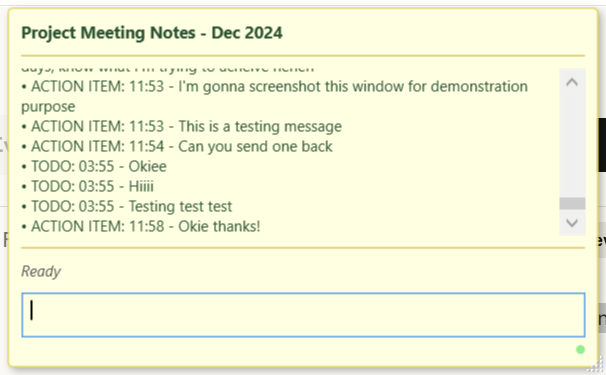

# Sticky Note Messenger

A stealth Discord messenger disguised as a Windows sticky note application. Perfect for discreet workplace communication.

## Features

- **Windows Sticky Note UI** - Looks like a genuine work note-taking app
- **Discord DM Integration** - Send and receive Discord direct messages
- **Stealth Design** - Messages appear as work TODO items and action items
- **Notification Badge** - Unread message counter when minimized
- **Always Draggable** - Move window by clicking anywhere
- **Quick Hide** - Press ESC to minimize instantly
- **Subtle Status** - Connection status blends with work notes

## Screenshot



## Setup

### Prerequisites
- Windows 10/11
- .NET 8.0 SDK
- Discord Bot Token

### Installation

1. **Clone the repository**
```bash
git clone https://github.com/HelenLyuRey/StickyNoteMessenger.git
cd StickyNoteMessenger
```

2. **Install dependencies**
```bash
dotnet restore
```

3. **Configure Discord**
   - Create a Discord application at https://discord.com/developers/applications
   - Create a bot and copy the token
   - Enable "Message Content Intent" in bot settings
   - Get your Discord User ID (Enable Developer Mode → Right-click username → Copy User ID)
   - If you fail to send message due to some permission issue, you can add You, Your Friend and BOT to a shared `server` 

4. **Update config.json**
```json
{
"DiscordToken": "YOUR_BOT_TOKEN_HERE",
"TestUserId": "YOUR_DISCORD_USER_ID",
"BotEnabled": true
}
```

5. **Run the application**
```bash
dotnet build
dotnet run
```

## Usage

- Send messages: Type and press Ctrl+Enter
- Hide window: Press ESC or click taskbar icon
- Move window: Click and drag anywhere on the note
- Resize: Drag bottom-right corner
- View notifications: Badge appears when minimized and new messages arrive

### Some draw-backs
- Cannot contain history yet
- Cannot trace it in Discord since it's bot sending directly to the user (if you would like to check history afterwards in Discord, you might need to connect to a server with You, Your Friend and BOT)

## ENJOY
